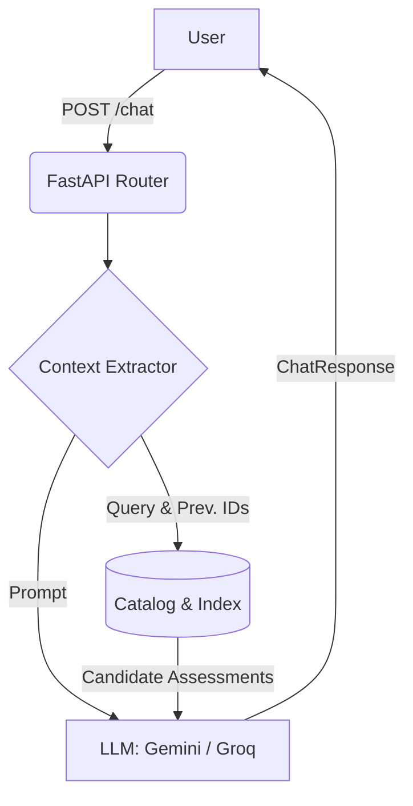

# SHL AI Intern Assessment

## Overview
This repository contains the backend service for an AI-powered recruiter and hiring coordinator chatbot, built for the SHL AI Intern Assessment. It analyzes conversational context between a recruiter and a candidate to dynamically recommend appropriate SHL assessments based on the role and skills discussed.

The application leverages **FastAPI** to serve HTTP endpoints and integrates with **Google Gemini** as its primary Large Language Model (LLM). In case of failures or rate limits, it features an automated fallback mechanism to **Groq** models (Meta LLaMA and Qwen) to ensure high availability.

## Features
- **Context Extraction:** Analyzes conversation history to generate targeted search queries.
- **Assessment Recommendations:** Uses a catalog retrieval system (RAG) to fetch and recommend relevant SHL assessments (technical and soft skills).
- **LLM Fallback Mechanism:** Robust fallback architecture shifting from Gemini to Groq if the primary LLM fails.
- **FastAPI Web Server:** Fast, modern, and type-safe API.
- **Dockerized:** Ready for deployment via Docker and Google Cloud Build.

## Architecture Flow



## Prerequisites
- Python 3.9+
- A Google Gemini API key
- A Groq API key (for fallback)

## Setup and Installation

1. **Clone the repository and navigate to the project directory:**
   ```bash
   git clone <repository_url>
   cd SHL_AI
   ```

2. **Set up a Python Virtual Environment:**
   ```bash
   python -m venv venv
   # On Windows:
   venv\Scripts\activate
   # On Mac/Linux:
   source venv/bin/activate
   ```

3. **Install Dependencies:**
   ```bash
   pip install -r requirements.txt
   ```

4. **Environment Variables:**
   Create a `.env` file in the root directory and add your API keys:
   ```env
   GEMINI_API_KEY=your_gemini_api_key_here
   GROQ_API_KEY=your_groq_api_key_here
   ```

## Running the Application

### Locally via Uvicorn
Start the FastAPI application using standard ASGI server:
```bash
uvicorn app.main:app --reload
```
The server will start at `http://127.0.0.1:8000`.

### Via Docker
Build and run the Docker image:
```bash
docker build -t shl-ai-assessment .
docker run -p 8000:8000 shl-ai-assessment
```

## API Endpoints

- **`GET /health`**
  Returns the health status of the application.

- **`POST /chat`**
  Main endpoint to interact with the recommender chatbot.
  **Payload:**
  ```json
  {
    "messages": [
      {"role": "user", "content": "We need to hire a Senior Java Developer."}
    ]
  }
  ```
  **Response:**
  Returns a `ChatResponse` containing the AI's `reply`, a list of `recommendations` (matching SHL assessments), and an `end_of_conversation` boolean flag.

## Project Structure
- `app/main.py`: FastAPI entrypoint.
- `app/recommender.py`: Core business logic, context extraction, and prompt generation.
- `app/llm_client.py`: LLM client handling API calls to Gemini and the fallback Groq implementation.
- `app/data_loader.py`: Loads the assessment catalog and search index.
- `app/models.py`: Pydantic data models for requests, responses, and catalog entries.